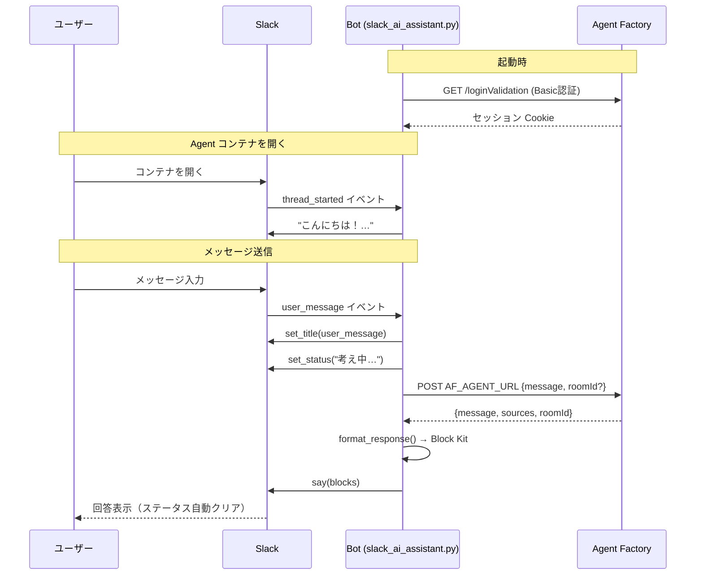
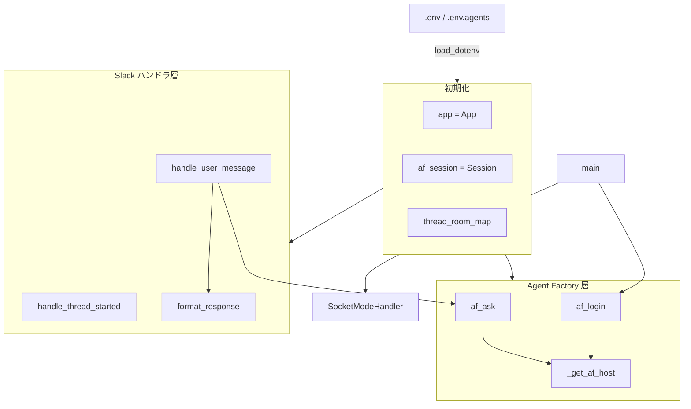

# event-oracle-code-night
2026/6/17 実施イベントの参考情報共有用のレポジトリです。

Slack の Agent コンテナでユーザーのメッセージを受け取り、Oracle AI Database Private Agent Factory に問い合わせて応答を返すエージェントスタイルの Slack アプリ。

## 動作フロー

```mermaid
sequenceDiagram
    participant U as ユーザー
    participant S as Slack
    participant B as Bot (slack_ai_assistant.py)
    participant AF as Agent Factory

    Note over B,AF: 起動時
    B->>AF: GET /loginValidation (Basic認証)
    AF-->>B: セッション Cookie

    Note over U,B: Agent コンテナを開く
    U->>S: コンテナを開く
    S->>B: thread_started イベント
    B->>S: "こんにちは！…"

    Note over U,B: メッセージ送信
    U->>S: メッセージ入力
    S->>B: user_message イベント
    B->>S: set_title(user_message)
    B->>S: set_status("考え中…")
    B->>AF: POST AF_AGENT_URL {message, roomId?}
    AF-->>B: {message, sources, roomId}
    B->>B: format_response() → Block Kit
    B->>S: say(blocks)
    S-->>U: 回答表示（ステータス自動クリア）
```

## モジュール構造

```mermaid
graph TD
    ENV[.env / .env.agents] -->|load_dotenv| INIT

    subgraph INIT[初期化]
        APP[app = App]
        SESSION[af_session = Session]
        MAP[thread_room_map]
    end

    subgraph AF_LAYER[Agent Factory 層]
        LOGIN[af_login]
        ASK[af_ask]
        HOST[_get_af_host]
        LOGIN --> HOST
        ASK --> HOST
    end

    subgraph SLACK_LAYER[Slack ハンドラ層]
        STARTED[handle_thread_started]
        MSG[handle_user_message]
        FMT[format_response]
        MSG --> ASK
        MSG --> FMT
    end

    INIT --> AF_LAYER
    INIT --> SLACK_LAYER
    MAIN[__main__] --> LOGIN
    MAIN --> SocketModeHandler
```
